---
diagram:
  engine:
    mermaid: true
title: Roderick Perendy | GIS & Construction Innovation
author: Roderick Perendy
shortbio: Senior GIS Developer | Automation | Backend Spatial Systems
description-meta: Senior GIS Developer focused on spatial backends, automation, and enterprise architecture.
og-url: https://vfroderick.github.io
#og-picture: website\img\profile-me.png
location: Orlando, FL
email: roderick.perendy@mortenson.com
clickable-email: true
picture: img/IMG_0609.jpeg
picture-round: false
side-by-side: true
github: vfroderick
linkedin: https://www.linkedin.com/in/roderick-perendy-7510967b
footer: >-
  [Senior Software Engineer Portfolio](https://vfroderick.github.io)
---

# Senior GIS Developer

I build and scale the technical foundations required for complex spatial data. My work focuses on backend architecture: databases, APIs, and automation pipelines that make high-performance mapping possible.

At Mortenson, I proposed and implemented our first ArcGIS Enterprise system and helped scale adoption across the organization.

## Technical Stack

  

| Category | Tools and Platforms |
| :--- | :--- |
| **Spatial Intelligence** | **Esri** ArcGIS Enterprise, Arcade, GeoEvent Server, Utility Network |
| **Backend & APIs** | **Node.js**, Python, Java, Scala, C#, REST APIs, MATLAB |
| **Infrastructure** | **Azure**, Azure DevOps, Docker, CI/CD, Linux |
| **Data Management** | **MS SQL Server**, MySQL, SQLite, Azure Blob Storage |

## Project Spotlights

```mermaid
xychart-beta
    title "GIS Adoption at Mortenson"
    x-axis ["Q3 22", "Q4 22", "Q1 23", "Q2 23", "Q3 23", "Q4 23", "Q1 24", "Q2 24", "Q3 24", "Q4 24", "Q1 25", "Q2 25", "Q3 25"]
    y-axis "Entitlements" 0 --> 2500
    bar [47, 61, 171, 229, 299, 370, 439, 554, 678, 801, 967, 1188, 1436]
    bar [123, 133, 155, 187, 223, 236, 272, 313, 368, 444, 525, 717, 981]
```

- [**Scaling Enterprise Location Intelligence**](https://files/Mortenson%20GIS%20Growth-ESRI.pdf)
- [**Construction Planning Application**](https://storymaps.arcgis.com/stories/830f37d3e71248ca923f839b44c11440)
  - Esri UC Presentation | San Diego, CA 2024

####

- **High-Performance Scheduling Integration**
  - Azure Synapse Scala Development
  - Common Data Model Solution - Over 20 different schedule file formats
  - Scalable with Apache Spark Runtime
  
- **AI Computer Vision for Construction Monitoring**
  - Production, Quality, Environmental Monitoring Solution
  - Integrates with GIS field worker responses to constantly refine training datasets

## Professional Experience and Impact

### Systems Architecture and DevOps

- Proposed and led the transition to ArcGIS Enterprise, scaling adoption from hundreds to thousands of entitlements.
- Built a standardized Docker + reverse-proxy dev environment to support multiple app versions cleanly.
- Developed CI/CD pipelines and automation for database maintenance and deployment workflows.
- Created ArcGIS Monitor dashboards for node-based health and root-cause analysis.

### Custom Spatial Solutions

- Developed Java/Scala tooling around MPXJ to unify construction scheduling formats into a single data model.
- Designed optimized SQL Server geodatabases with automation for high-frequency updates.
- Implemented real-time telemetry workflows using GeoEvent Server and fleet/asset tracking integrations.
- Engineered a Utility Network dataset for complex material tracking on large-scale projects.

## Education and Recognition

- **Speaker at Esri UC 2024:** [Plan of the Day (POD) for Wind Projects](https://storymaps.arcgis.com/stories/830f37d3e71248ca923f839b44c11440)
- **Bachelor of Science in Mechanical Engineering** | University of North Dakota
- **Bachelor of Science in Economics** | University of Minnesota

